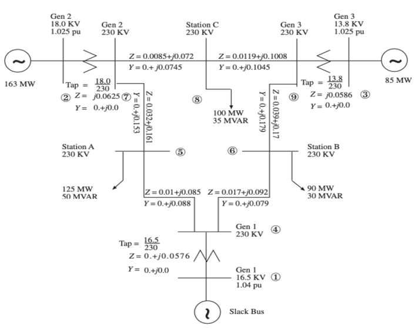
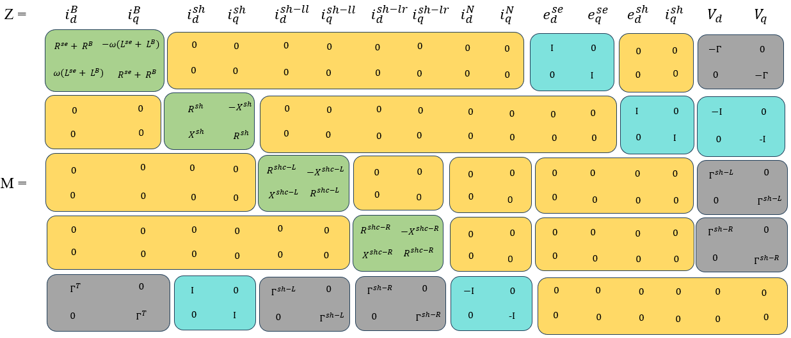
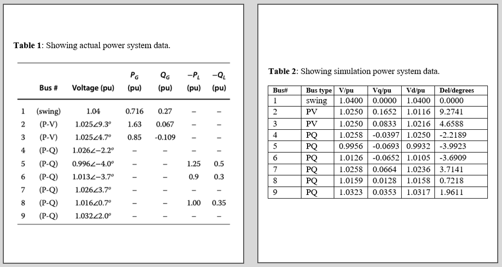

# Optimal Power Flow of a 9-Bus System using dq Modeling

## Overview
This project implements an optimal power flow (OPF) analysis of a 9-bus test system using MATLAB. The system is modeled in dq-coordinates, transforming voltages, currents, and network equations into the direct-quadrature domain for efficient numerical solution.

---

## Objective
- Formulate power flow equations in dq-domain  
- Solve power flow using constrained optimization (`fmincon`)  
- Validate results against standard 9-bus system data  

---

## System Model

### 9-Bus Network

Standard 9-bus benchmark system used for analysis.

---

### Line Connectivity Data

Defines how buses are interconnected and is used to construct the node incidence matrix.

---

## Mathematical Formulation

### dq-Domain Representation (M-Matrix)

The M-matrix represents the relationship between:
- Branch currents  
- Bus currents  
- Bus voltages in d and q coordinates  

---

## Methodology
- Transform system equations into dq-domain  
- Construct network matrices  
- Apply power flow constraints  
- Solve using MATLAB `fmincon`  
- Compute voltages, angles, and losses  

---

## Code Implementation (Summary)

The MATLAB implementation follows these key steps:

### System Initialization  
`nN = 9`, `nB = 9`, `Sb = 100`  
Defines the number of buses, branches, and base power.

---

### Line Data Definition  
`linedata = [1 4 0 0.0576 0 250; ... ];`  

Defines:
- From and to buses  
- Line impedance  
- Line ratings  

---

### Network Topology  
`Gamma = [...];`  

Represents the incidence matrix describing how buses are connected.

---

### System Matrix Construction  
`M = horzcat(vertcat(aux1, aux2), aux3);`  

Combines all system equations into a single matrix describing the network.

---

### Optimization Solver  
`[SOL, fval, exitflag] = fmincon(...)`  

Solves the power flow problem using constrained nonlinear optimization.

---

### Objective Function  
`C = 1`  

A constant objective function is used, meaning the solution is driven entirely by constraints.

---

### Power Flow Constraints  
Example:  
`vd(2)*iNd(2) + vq(2)*iNq(2) - P(2) = 0`  

Ensures power balance at each bus:
- Active power  
- Reactive power  
- Voltage constraints  

---

### Voltage Calculation  
`V = sqrt(vd.^2 + vq.^2)`  
`δ = atan(vq./vd)`  

Computes voltage magnitude and angle from dq components.

---

### Loss Calculation  
`Losses = sum(SB)`  

Calculates total system losses.

---

## Results

### Voltage Comparison

- Voltage magnitude error < 0.01 pu  
- Voltage angle error < 1°  
- Strong agreement with benchmark system  

---

## Key Insights
- dq-domain modeling is effective for power flow analysis  
- Optimization using `fmincon` converges reliably  
- Results closely match standard 9-bus data  
- Method can be extended to:
  - Larger systems  
  - Optimal power flow problems  
  - Additional constraints  

---

## Tools Used
- MATLAB  

---

## Files
- dq_PowerFlow_without_FACTS_fmincon_9BUS.m  

---

## Conclusion
This project demonstrates the successful implementation of power flow analysis using dq-domain modeling and constrained optimization. The results validate the approach and highlight its potential for advanced power system applications.

---

## Author
Royalty Holyworth Chihava
